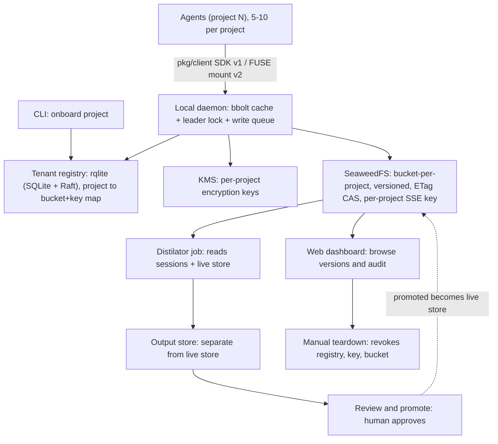
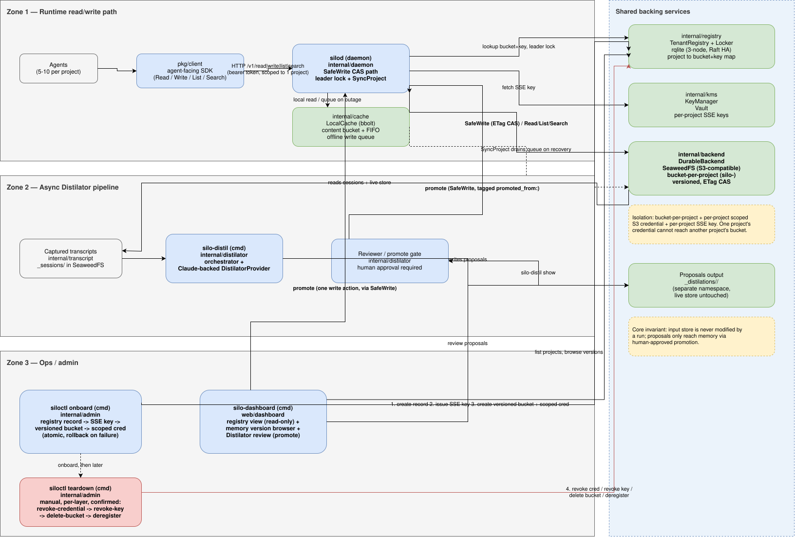

# Silo — Architecture

This is the narrative companion to the spec in
[`../silo-project-scaffold.md`](../silo-project-scaffold.md), which remains the
source of truth for locked-in decisions and interface contracts. This document
summarizes the shape of the system, the build sequence, and the v1 acceptance
criteria.

## Overview

Silo gives an agent fleet **persistent, versioned, multi-tenant memory** with
strict per-project isolation, plus an out-of-band consolidation cycle
(**Distilator**) that refines each project's memory from its own sessions.

## Zones

- **Runtime read/write path** — Agents → daemon → registry / KMS / SeaweedFS.
- **Async Distilator pipeline** — SeaweedFS → Distilator job → output store →
  review.
- **Ops / admin** — dashboard and the manual, per-layer teardown.

Editable source: [`architecture/system-arch.drawio`](./architecture/system-arch.drawio)
(open at [app.diagrams.net](https://app.diagrams.net) or the VS Code Draw.io
Integration extension).

## Core interfaces (the contract)

| Interface | Package | Role |
|---|---|---|
| `DurableBackend` | `internal/backend` | Durable object storage; SeaweedFS adapter is default |
| `LocalCache` | `internal/cache` | bbolt fast path + offline write queue |
| `TenantRegistry` | `internal/registry` | project → bucket/credential/key, on rqlite |
| `KeyManager` | `internal/kms` | per-project SSE keys, on Vault |
| `DistilatorProvider` | `internal/distilator` | "what should change in memory" judgment; Claude-backed |
| `client.Client` | `pkg/client` | agent-facing Read/Write/List/Search |

The daemon's `SafeWrite` (`internal/daemon/writepath.go`) is the CAS write path:
read current version → apply edit → `Put` with `If-Match` on the ETag → retry on
precondition failure → fall back to the local queue when the backend is
unreachable.

## Build sequence

Build one increment at a time; each should compile and pass its tests before the
next.

1. `internal/cache` (bbolt) + `internal/backend` (SeaweedFS) + `SafeWrite` — core
   write path end to end against local SeaweedFS.
2. `internal/registry` (rqlite) + `internal/kms` (Vault) + `internal/admin`
   onboarding — one-command onboarding.
3. `internal/daemon` — wire cache + backend + registry + kms; add leader
   election/locking and the write-queue-on-backend-down path.
4. `pkg/client` — the thin SDK agents import.
5. `internal/distilator` — orchestrator + Claude-backed provider + review/promote.
6. `web/dashboard` — v1 read/review surface.
7. `internal/admin/teardown.go` + `siloctl teardown` — last; destructive.

## Local dev environment

`docker compose -f ../deploy/docker-compose.yaml up` brings up SeaweedFS, a
3-node rqlite cluster, and Vault (dev mode). Three rqlite nodes so local dev
actually exercises Raft: kill any one and the cluster keeps serving via leader
election. Config defaults live in [`../configs/example.yaml`](../configs/example.yaml)
and are dev-only.

## v1 definition of done

The full acceptance checklist is Section 10 of the spec. In brief, v1 is done
when: the local stack comes up and survives an rqlite leader kill; the SeaweedFS
adapter and bbolt cache pass their tests (including precondition-failed on a
conflicting `IfMatchETag` and enqueue/drain); `SafeWrite` retries a forced
concurrent conflict rather than overwriting; `siloctl onboard` provisions and
rolls back atomically; isolation is proven (one project's credential genuinely
cannot reach another's bucket); the daemon queues and later syncs writes across
a backend outage with no loss; `pkg/client` works from a separate process; a full
Distilator cycle runs transcripts → proposals → separate output → human-approved
promotion via `SafeWrite`; and the dashboard lists projects, shows version
history, and approves/rejects proposals.

## Deferred past v1

FUSE-mounted `.md` filesystem (v1 is SDK-only), backpressure beyond SeaweedFS's
own limits, multi-region topology, dashboard RBAC, automated teardown, and a
cloud KMS adapter. The rqlite registry choice is accepted for now and revisited
once there's production mileage.
