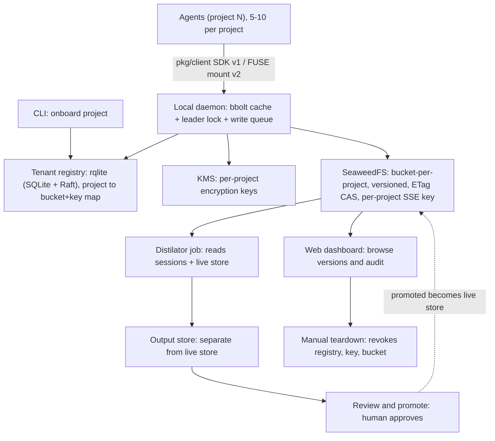

# Silo — Project Scaffold

**Silo** is a pluggable Golang connector that gives any repo's agent fleet persistent, versioned, multi-tenant memory with an out-of-band consolidation cycle (**Distilator**).

## Naming

The two names tell one coherent story, and it's worth keeping in mind while building — it's a useful check on whether a design choice still fits the product:

- **Silo** — chosen for the property that mattered most and was the hardest-won part of the design: strict per-project isolation. Bucket-per-project, scoped credentials, per-project encryption keys, no cross-tenant access by default. Each project's memory genuinely lives in its own silo; nothing leaks between them.
- **Distilator** — the out-of-band consolidation job that runs *inside* each Silo. It reads a project's own sessions and its own memory store, and refines them into something better — never touching another project's data, because it never has access to it.

Silo for isolation, Distilator for consolidation running inside it — if a future feature can't be described in those terms, that's worth pausing on.

## What it does

A pluggable Golang connector that gives any repo's agent fleet persistent, versioned, multi-tenant memory with an out-of-band consolidation cycle.

Reference architecture: see the accompanying Excalidraw diagram (three zones — runtime read/write path, async Distilator pipeline, ops/admin — plus CLI onboarding, plus the pkg/client access-layer annotation between Agents and Local daemon).

---

## 0. Instructions for Claude Code

This document is the spec. Read it in full before writing any code.

- **Locked-in decisions (Section 1) are not up for silent revision.** If something in Section 1 seems wrong once you're implementing it, stop and flag it rather than substituting your own choice.
- **Build in the order given in Section 8**, one numbered step at a time. Each step should be a working, tested increment — don't jump ahead to step 4 before step 1 compiles and passes its tests.
- **Interfaces in Section 3 are the contract.** Implement against the interface signatures as given; if a signature needs to change, say so explicitly rather than quietly diverging from the doc.
- **Start here, in order:**
  1. `go mod init` in a new `silo/` directory using the layout in Section 2.
  2. Stand up local dependencies with the docker-compose setup in Section 8.5 before writing any backend code — you need a running SeaweedFS, the rqlite cluster, and Vault (dev mode) to test against.
  3. Implement Section 3.1 (`DurableBackend`) and 3.2 (`LocalCache`) first, with tests that run against the docker-compose services.
  4. Confirm `SafeWrite` (Section 3.6) works end-to-end — write, read, concurrent-write-conflict-and-retry — before moving to registry/KMS/onboarding.
- **Definition of done for v1** is the checklist in Section 10 — treat it as the acceptance criteria for the whole build, not just a suggestion.
- If a decision in this doc is ambiguous or missing (e.g., exact SeaweedFS IAM policy syntax, exact Vault API calls), make the smallest reasonable choice, implement it, and note the choice in a code comment — don't block on it.

---

## Architecture diagram (text form)

Canonical version is the Excalidraw board; this mirrors it in text so the document is self-contained.



Zones (as drawn in the Excalidraw board): **runtime read/write path** (Agents → daemon → registry/KMS/SeaweedFS), **async Distilator pipeline** (SeaweedFS → Distilator job → output store → review), **ops/admin** (dashboard, manual teardown).

---

## 1. Design summary (decisions locked in)

| Concern | Decision |
|---|---|
| Local cache | bbolt, one instance per project |
| Durable backend | SeaweedFS (S3-compatible), bucket-per-project |
| Concurrency control | ETag-based conditional writes (`If-Match`) |
| Versioning / rollback | Native S3 object versioning on each bucket |
| Isolation | Bucket-per-project + per-project scoped IAM credential + per-project SSE encryption key |
| Key management | Self-hosted KMS (e.g. Vault) |
| Tenant registry | rqlite (SQLite semantics + Raft consensus) table: project → bucket, credential, key |
| Onboarding | Single, fully automated CLI command |
| Multi-instance daemon safety | Leader election / per-project locking |
| Backend-unreachable behavior | Queue writes locally in bbolt, sync on recovery |
| Distilator | Writes to a separate output store; input store never modified; human review gate before promotion |
| Observability | Simple web dashboard (v1) — browse versions, audit trail |
| Decommissioning | Fully manual, explicit approval per layer (registry → key → bucket) |
| Backpressure | None custom for v1 — rely on SeaweedFS's own limits |
| Agent access layer | v1: Go client SDK (`pkg/client`) — agents call `Read`/`Write`, not raw filesystem ops. FUSE-mounted `.md` filesystem tracked as a v2 upgrade |

---

## 2. Repo layout

```
silo/
├── cmd/
│   ├── silod/                    # the daemon binary
│   │   └── main.go
│   ├── siloctl/                  # CLI (onboarding, teardown, admin)
│   │   └── main.go
│   └── silo-distil/            # standalone Distilator-job runner (invoked by silod or on a schedule)
│       └── main.go
├── internal/
│   ├── cache/                  # local per-project cache (bbolt)
│   │   ├── store.go
│   │   └── store_test.go
│   ├── backend/                # durable backend abstraction + SeaweedFS adapter
│   │   ├── backend.go          # DurableBackend interface
│   │   ├── seaweedfs.go        # SeaweedFS/S3 implementation
│   │   └── backend_test.go
│   ├── registry/                # tenant registry (rqlite: SQLite + Raft)
│   │   ├── registry.go
│   │   ├── rqlite.go
│   │   └── migrations/
│   ├── kms/                     # encryption key management
│   │   ├── kms.go               # KeyManager interface
│   │   └── vault.go              # Vault implementation
│   ├── daemon/                  # daemon core: session handling, write path, locking
│   │   ├── daemon.go
│   │   ├── writepath.go          # hash/ETag CAS write logic
│   │   ├── queue.go               # local write queue for backend-down scenarios
│   │   └── lock.go                # leader election / per-project locking
│   ├── transcript/                # session transcript capture
│   │   └── transcript.go
│   ├── distilator/                     # Distilator (memory consolidation) pipeline
│   │   ├── distilator.go                # orchestrator
│   │   ├── provider.go             # DistilatorProvider interface (pluggable LLM backend)
│   │   ├── claude.go               # Claude-backed implementation
│   │   └── review.go                # review/promote gate
│   └── admin/                       # onboarding + teardown logic shared by CLI and daemon
│       ├── onboard.go
│       └── teardown.go
├── pkg/
│   └── client/                       # agent-facing SDK — the access layer between agents and bbolt/SeaweedFS
│       ├── client.go
│       └── adapters/                  # per-agent-framework integration adapters (added as built)
├── web/
│   └── dashboard/                     # minimal web dashboard (v1)
│       ├── server.go
│       ├── registry_view.go            # tenant registry table view (reads internal/registry directly)
│       ├── memory_view.go               # memory paths + version history browser
│       ├── distilator_view.go            # pending Distilator proposals, diff + approve/reject
│       └── static/
├── configs/
│   └── example.yaml
├── deploy/
│   ├── docker-compose.yaml            # daemon + SeaweedFS + rqlite cluster + Vault, for local dev
│   └── migrations/
├── docs/
│   └── architecture.md                # narrative doc + exported diagram
├── go.mod
└── README.md
```

---

## 3. Core interfaces

### 3.1 `DurableBackend` (`internal/backend/backend.go`)

```go
package backend

import "context"

// ObjectVersion identifies a specific version of a stored memory object.
type ObjectVersion struct {
    VersionID string
    ETag      string
    ModifiedAt string // RFC3339
}

// PutOptions carries the metadata attached to a write (actor, session, etc.)
// and the optional CAS precondition.
type PutOptions struct {
    IfMatchETag string // empty = unconditional write
    Actor       string // agent ID or human user ID
    SessionID   string
    Tags        map[string]string
}

// DurableBackend is the interface every storage adapter implements.
// The SeaweedFS adapter is the default (internal/backend/seaweedfs.go);
// swap in another S3-compatible implementation without touching callers.
type DurableBackend interface {
    // Put writes content to path within a project's bucket. Returns the
    // resulting version. If opts.IfMatchETag is set and doesn't match the
    // current object's ETag, returns ErrPreconditionFailed.
    Put(ctx context.Context, projectID, path string, content []byte, opts PutOptions) (ObjectVersion, error)

    // Get fetches the current (or a specific) version of an object.
    Get(ctx context.Context, projectID, path string, versionID string) ([]byte, ObjectVersion, error)

    // ListVersions returns version history for a path, newest first.
    ListVersions(ctx context.Context, projectID, path string) ([]ObjectVersion, error)

    // Delete removes an object (creates a delete marker; version history persists).
    Delete(ctx context.Context, projectID, path string) error

    // CreateBucket provisions a new project's bucket with versioning enabled.
    // Called only from the onboarding path.
    CreateBucket(ctx context.Context, projectID string) error

    // DeleteBucket is the destructive teardown step. Called only from the
    // manual teardown flow, one explicit call per layer.
    DeleteBucket(ctx context.Context, projectID string) error
}

var ErrPreconditionFailed = errors.New("backend: precondition failed (concurrent write)")
```

### 3.2 `LocalCache` (`internal/cache/store.go`)

```go
package cache

import "context"

// LocalCache is the bbolt-backed fast path agents actually read/write
// during a live session. It never talks to the network directly — the
// daemon's write path is responsible for syncing to DurableBackend.
type LocalCache interface {
    Get(ctx context.Context, projectID, path string) ([]byte, error)
    Put(ctx context.Context, projectID, path string, content []byte) error
    Delete(ctx context.Context, projectID, path string) error

    // Enqueue records a write that couldn't sync to the durable backend
    // (backend unreachable). Drained by the sync worker on recovery.
    Enqueue(ctx context.Context, projectID string, w PendingWrite) error
    DrainQueue(ctx context.Context, projectID string) ([]PendingWrite, error)
}

type PendingWrite struct {
    Path      string
    Content   []byte
    Actor     string
    SessionID string
    QueuedAt  string
}
```

### 3.3 `TenantRegistry` (`internal/registry/registry.go`)

```go
package registry

import "context"

type ProjectRecord struct {
    ProjectID    string
    BucketName   string
    CredentialID string // reference into KMS/secrets, not the raw credential
    KeyID        string // KMS key ID for this project's SSE key
    CreatedAt    string
    Status       string // "active" | "decommissioning" | "decommissioned"
}

// TenantRegistry is the source of truth for project -> bucket/credential/key
// mapping. Backed by an rqlite cluster (SQLite semantics, Raft-replicated).
type TenantRegistry interface {
    Register(ctx context.Context, rec ProjectRecord) error
    Get(ctx context.Context, projectID string) (ProjectRecord, error)
    List(ctx context.Context) ([]ProjectRecord, error)
    UpdateStatus(ctx context.Context, projectID string, status string) error
    Deregister(ctx context.Context, projectID string) error // final step of teardown
}
```

### 3.4 `KeyManager` (`internal/kms/kms.go`)

```go
package kms

import "context"

// KeyManager issues and retrieves per-project encryption keys.
// The Vault implementation is the default; interface allows swapping
// in a cloud KMS later without touching callers.
type KeyManager interface {
    CreateKey(ctx context.Context, projectID string) (keyID string, err error)
    GetKey(ctx context.Context, keyID string) ([]byte, error) // raw key material, for SSE-C use
    RevokeKey(ctx context.Context, keyID string) error        // teardown step
}
```

### 3.5 `DistilatorProvider` (`internal/distilator/provider.go`)

```go
package distilator

import "context"

type Transcript struct {
    SessionID string
    Messages  []byte // serialized session content: messages + tool calls + metadata
}

type ProposedChange struct {
    Path       string
    NewContent []byte
    Rationale  string
    Evidence   []string // session IDs that motivated this change
    Prevalence float64  // 0.0-1.0, how common the pattern was across the batch
}

// DistilatorProvider runs the actual "what should change in memory" judgment.
// Default implementation calls out to Claude; the interface exists so a
// different model/provider can be swapped in without touching orchestration.
type DistilatorProvider interface {
    ProposeChanges(ctx context.Context, currentStore map[string][]byte, transcripts []Transcript, instructions string) ([]ProposedChange, error)
}
```

### 3.6 Daemon write path (`internal/daemon/writepath.go`) — pseudocode

```go
func (d *Daemon) SafeWrite(ctx context.Context, projectID, path string, edit func([]byte) []byte, actor, sessionID string) error {
    for attempt := 0; attempt < maxRetries; attempt++ {
        current, ver, err := d.backend.Get(ctx, projectID, path, "")
        if err != nil && !errors.Is(err, backend.ErrNotFound) {
            // backend unreachable: fall back to local cache + queue
            return d.cache.Enqueue(ctx, projectID, cache.PendingWrite{
                Path: path, Content: edit(nil), Actor: actor, SessionID: sessionID,
            })
        }

        newContent := edit(current)

        _, err = d.backend.Put(ctx, projectID, path, newContent, backend.PutOptions{
            IfMatchETag: ver.ETag,
            Actor:       actor,
            SessionID:   sessionID,
        })
        if errors.Is(err, backend.ErrPreconditionFailed) {
            continue // someone else wrote in the meantime — retry
        }
        if err != nil {
            return err
        }

        _ = d.cache.Put(ctx, projectID, path, newContent) // keep local cache warm
        return nil
    }
    return ErrTooManyConflicts
}
```

### 3.7 `pkg/client` — the agent-facing access layer

**This is the piece that resolves "bbolt vs markdown" — bbolt (and SeaweedFS) store the memory as plain markdown bytes; nothing about the *content* changes format as it moves between layers. What was underspecified is *how an agent gets at those bytes*, since agents never talk to bbolt directly.**

v1 approach: agents (or the harness wrapping them) call this SDK instead of native file I/O. It's the only piece of integration work required to wire an agent framework into the system.

```go
package client

import "context"

// Client is what an agent (or the harness around it) imports directly.
// Every method operates on markdown content — callers read/write the
// same text they'd write to a plain .md file; the SDK handles routing
// to the local cache and, transparently, to the durable backend via
// the daemon's write path (hash/ETag CAS, versioning, etc.)
type Client interface {
    // Read returns the current markdown content at path within the
    // caller's project scope.
    Read(ctx context.Context, path string) ([]byte, error)

    // Write persists new markdown content at path. Internally goes
    // through the daemon's SafeWrite (CAS + versioning) — the caller
    // never needs to think about conflicts or retries.
    Write(ctx context.Context, path string, content []byte) error

    // List returns memory paths under a prefix (mirrors browsing a
    // directory of .md files).
    List(ctx context.Context, pathPrefix string) ([]string, error)

    // Search does a simple substring/grep-style search across memory
    // content under a prefix — the SDK's answer to "let agents grep
    // their memory" without a real mounted filesystem underneath.
    Search(ctx context.Context, pathPrefix, query string) ([]SearchResult, error)
}

type SearchResult struct {
    Path    string
    Snippet string
}
```

Configuration: the SDK is initialized with a `ProjectID` and a daemon endpoint (local Unix socket for same-machine agents, or a network address). It authenticates using the project-scoped credential issued at onboarding — the SDK never sees another project's credential or key.

**Framework integration is a thin adapter, not a rewrite.** For a CLI-based agent framework (Claude Code, Codex CLI, custom harnesses), the integration point is wherever that framework already exposes a memory-read/write hook or custom tool definition — point that hook at this `Client` instead of local disk. Exact shape depends on the framework; document one adapter per supported framework under `pkg/client/adapters/` as they're built (e.g. `adapters/claudecode/`).

**Tracked v2 upgrade: FUSE-mounted filesystem.** Instead of agents calling an SDK, the daemon mounts `/mnt/memory/<project>/` as a real filesystem (FUSE on Linux; macFUSE/WinFsp elsewhere) backed by bbolt/SeaweedFS underneath. Agents then use native `cat`/`grep`/file-edit tools directly on real `.md` files — no per-framework adapter needed, matching how Claude Code's own memory and Anthropic's Managed Agents memory stores are mounted. Deferred past v1 because of the added OS-level complexity (especially cross-platform), but it's the more natural long-term fit for "let agents use the tools they already know," and the underlying content format doesn't change either way — this is purely an access-layer swap, `internal/cache` and `internal/backend` stay identical.

---

## 4. Onboarding flow (`internal/admin/onboard.go`)

Single CLI command: `siloctl onboard --project=proj-11`

1. `registry.Register` — creates the tenant record (status: `active`)
2. `kms.CreateKey` — provisions a per-project SSE key, stores `keyID` on the record
3. `backend.CreateBucket` — creates the bucket with versioning enabled, applies the SSE key
4. Issues a scoped credential for the bucket (implementation-specific to your SeaweedFS IAM setup), stores `credentialID` on the record
5. Local cache directory initialized on first daemon contact for the project (lazy, not part of onboarding itself)

All five steps run in one command; if any step fails, `siloctl onboard` should roll back the steps already completed rather than leaving a half-provisioned project (implement as a simple compensating-action stack, not a distributed transaction).

## 5. Teardown flow (`internal/admin/teardown.go`)

Deliberately **not** automated end-to-end — explicit approval at each layer, matching the locked-in decision:

```
siloctl teardown --project=proj-11 --step=revoke-credential   # step 1, confirm
siloctl teardown --project=proj-11 --step=revoke-key           # step 2, confirm
siloctl teardown --project=proj-11 --step=delete-bucket        # step 3, confirm (irreversible)
siloctl teardown --project=proj-11 --step=deregister           # step 4, confirm
```

Each step requires an interactive confirmation (or `--yes` for scripted use, but default to requiring it). `registry.UpdateStatus` moves the record to `decommissioning` after step 1, `decommissioned` after step 4.

## 6. Distilator cycle sequencing

1. Triggered manually or on a schedule (`silo-distil run --project=proj-11 --since=24h`)
2. Pulls up to N recent transcripts for the project's scope + the current memory store content
3. `DistilatorProvider.ProposeChanges` returns a list of proposed diffs with evidence
4. Orchestrator writes proposals to a **separate output path** in the same bucket (e.g. `_distilations/<run-id>/`) — never touches the live memory path
5. Surfaces the proposal set in the web dashboard for human review
6. On approval, promotion writes the accepted changes through the normal `SafeWrite` path (so they get the same ETag/versioning treatment as any other write) and tags them `promoted_from: <run-id>`
7. On rejection, the `_distilations/<run-id>/` output is left in place (for audit) or explicitly cleaned up

## 7. Web dashboard (v1 scope)

Three views, all served by the same small `web/dashboard` binary, querying the rqlite cluster over its HTTP API and reading SeaweedFS directly — no separate API layer needed for v1.

### 7.1 Tenant registry view (`registry_view.go`)

The dashboard's home page. Queries `internal/registry`'s rqlite cluster and lists every project record:

| Column | Source |
|---|---|
| Project ID | `ProjectRecord.ProjectID` |
| Status | `ProjectRecord.Status` (`active` / `decommissioning` / `decommissioned`) |
| Bucket | `ProjectRecord.BucketName` |
| Credential ref | `ProjectRecord.CredentialID` (reference only — never render the actual credential) |
| Key ref | `ProjectRecord.KeyID` (reference only — never render key material) |
| Created | `ProjectRecord.CreatedAt` |

**Read-only.** This view never issues a credential, revokes a key, or deletes a bucket — those stay exclusively in `siloctl teardown`'s explicit, per-layer, confirmed CLI flow (Section 5). The dashboard's only job here is visibility: "what projects exist, what state are they in." If a project shows `decommissioning`, the view should surface which teardown step it's stuck at (derived from `Status` plus whatever the last completed step was), so a human knows what CLI command to run next — but the dashboard itself never runs that command.

### 7.2 Memory version browser (`memory_view.go`)

- List projects (from `TenantRegistry`)
- Browse a project's memory paths and version history (`ListVersions`)
- View a specific version's content (decrypted server-side — never expose raw ciphertext or keys to the browser)

### 7.3 Distilator review (`distilator_view.go`)

- List pending Distilator proposals, view diffs, approve/reject (this is the one *write* action the dashboard performs anywhere)

Explicitly out of scope for v1: user management/auth beyond a single admin credential, multi-user RBAC, metrics/alerting.

## 8. Suggested build sequence

1. `internal/cache` (bbolt) + `internal/backend` (SeaweedFS adapter) + basic `SafeWrite` — prove the core write path works end to end against a local SeaweedFS instance (`deploy/docker-compose.yaml`).
2. `internal/registry` (rqlite) + `internal/kms` (Vault) + `internal/admin/onboard.go` — prove one-command onboarding.
3. `internal/daemon` — wire cache + backend + registry + kms together behind the daemon process; add leader election/locking and the write-queue-on-backend-down path.
4. `pkg/client` — the thin SDK agents actually import.
5. `internal/distilator` — Distilator orchestrator + Claude-backed `DistilatorProvider` + review/promote.
6. `web/dashboard` — v1 read/review surface.
7. `internal/admin/teardown.go` + `siloctl teardown` — last, since it's destructive and least urgent for a working v1.

## 8.5 Local dev environment

Everything needed to develop and test against, runnable with `docker compose -f deploy/docker-compose.yaml up`:

```yaml
# deploy/docker-compose.yaml
services:
  seaweedfs:
    image: chrislusf/seaweedfs
    command: "server -s3 -s3.port=8333"
    ports:
      - "8333:8333"   # S3 API
      - "9333:9333"   # master UI

  rqlite1:
    image: rqlite/rqlite
    command: ["-node-id", "1", "-http-addr", "0.0.0.0:4001", "-raft-addr", "0.0.0.0:4002"]
    ports:
      - "4001:4001"

  rqlite2:
    image: rqlite/rqlite
    command: ["-node-id", "2", "-http-addr", "0.0.0.0:4001", "-raft-addr", "0.0.0.0:4002", "-join", "http://rqlite1:4001"]
    depends_on:
      - rqlite1

  rqlite3:
    image: rqlite/rqlite
    command: ["-node-id", "3", "-http-addr", "0.0.0.0:4001", "-raft-addr", "0.0.0.0:4002", "-join", "http://rqlite1:4001"]
    depends_on:
      - rqlite1

  vault:
    image: hashicorp/vault
    cap_add:
      - IPC_LOCK
    environment:
      VAULT_DEV_ROOT_TOKEN_ID: dev-only-token
    ports:
      - "8200:8200"
```

Three nodes so local dev actually exercises the thing you're relying on: kill any one `rqliteN` container and the cluster keeps serving reads/writes off the remaining two via Raft leader election. Only `rqlite1`'s HTTP port is exposed to the host for client access in this example; the client library should be pointed at all three addresses (or a discovery mechanism) in a real deployment so it can find the current leader if `rqlite1` specifically goes down.

No Postgres service — the tenant registry runs as a 3-node rqlite cluster, giving SQLite semantics with real Raft-based high availability instead of a single file with no replication.

Local config (`configs/example.yaml`) should point at these by default:


```yaml
backend:
  endpoint: "http://localhost:8333"
  region: "us-east-1"       # SeaweedFS S3 gateway ignores region but the client lib expects one

registry:
  driver: "rqlite"
  addresses:
    - "http://localhost:4001"
  # client should retry against other known nodes if the current one
  # isn't the leader; the rqlite Go client (rqlite/gorqlite) handles
  # leader redirects automatically

kms:
  driver: "vault"
  address: "http://localhost:8200"
  token: "dev-only-token"    # dev only — never a real credential in this file

cache:
  path: "./data/cache"        # bbolt files, one per project, live here locally
```

Never commit real Vault tokens, SeaweedFS credentials, or registry file paths to `configs/example.yaml` — it's dev-only scaffolding. Production config is supplied via environment variables or a secrets manager, not a checked-in file.

## 9. Open items deferred past v1 (tracked, not forgotten)

- FUSE-mounted `.md` filesystem as an alternative to the SDK-based agent access layer (v1 ships SDK-only)
- Backpressure/rate limiting against SeaweedFS beyond its own defaults
- Multi-region / multi-daemon-instance topology beyond simple leader election
- RBAC in the web dashboard
- Automated teardown (currently intentionally manual)
- Cloud KMS adapter (Vault is the only implementation for now)

### Low priority — revisit later, not blocking v1

- **Tenant registry storage choice (rqlite).** rqlite is accepted as good enough for now — it solves the single-point-of-failure concern with real Raft-based HA. Revisit once there's actual production experience with it: specifically whether operating a 3-node Raft cluster is worth it at this scale versus, say, SQLite+Litestream (simpler, less HA) or Postgres (heavier, more mature tooling) — this was a judgment call made without production mileage on any of the three options, not a settled-forever decision.

## 10. Definition of done for v1

Referenced from Section 0 — treat this as the acceptance checklist for the whole build, not any single step.

- [ ] `docker compose -f deploy/docker-compose.yaml up` brings up SeaweedFS, the 3-node rqlite cluster, and Vault cleanly; the cluster elects a leader and `internal/registry` can read/write against it
- [ ] Killing the current rqlite leader container doesn't stop registry reads/writes — a new leader is elected and the client transparently follows it
- [ ] `internal/backend` (SeaweedFS adapter) passes tests: put, get, list versions, delete, precondition-failed on conflicting `IfMatchETag`
- [ ] `internal/cache` (bbolt) passes tests: put, get, delete, enqueue/drain for the offline-write-queue path
- [ ] `SafeWrite` has a test that forces a concurrent-write conflict and confirms it retries and succeeds rather than silently overwriting
- [ ] `siloctl onboard --project=X` provisions a bucket, key, and registry entry in one command, and rolls back cleanly if any step fails partway
- [ ] The web dashboard's registry view lists every project from rqlite with correct status, bucket, and credential/key references (references only, never raw secrets)
- [ ] A project's bucket is genuinely unreachable using another project's credential (isolation test, not just code review)
- [ ] The daemon queues writes locally when SeaweedFS is stopped, and syncs them once it's restarted, with no data loss
- [ ] `pkg/client` `Read`/`Write`/`List`/`Search` work against a running daemon from a separate test process
- [ ] A full Distilator cycle runs end to end: transcripts in → proposed changes with evidence → written to a separate output path → input store unchanged → human approval promotes the changes through `SafeWrite`
- [ ] The web dashboard lists projects, shows version history for a memory path, and can approve/reject a pending Distilator proposal
- [ ] `siloctl teardown` requires a separate confirmed step per layer (credential, key, bucket, registry) and cannot be run as a single unconfirmed command
- [ ] README documents how to run the whole stack locally and exercise one full read/write/distil/promote cycle by hand
